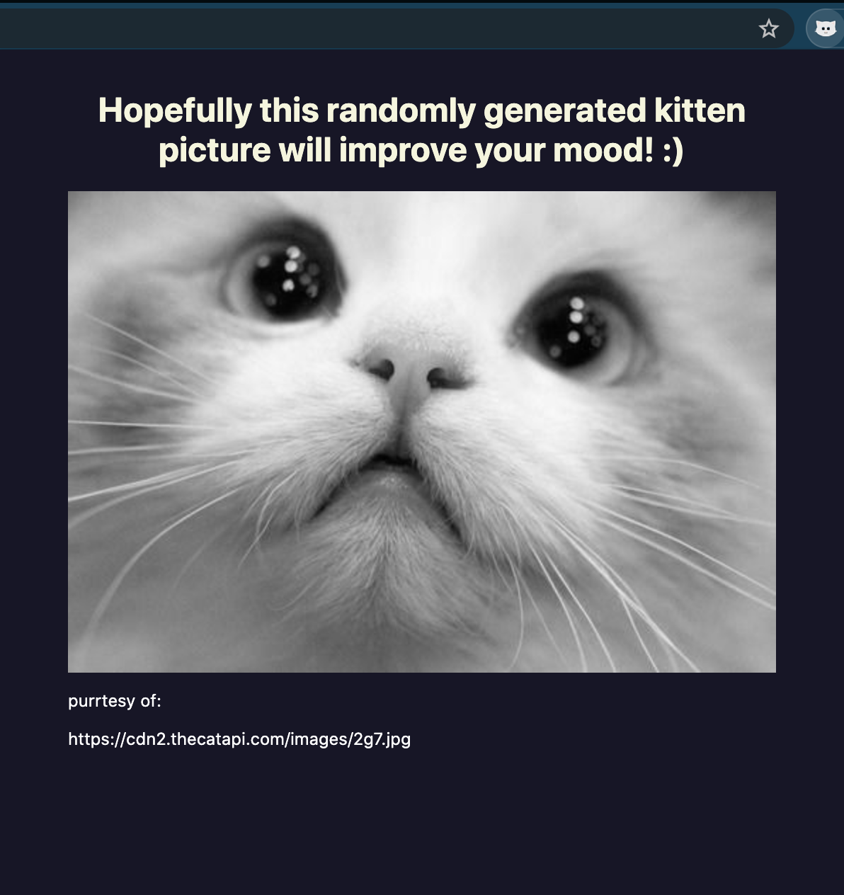

# Objective
I couldn't find my cat to comfort me so I made this Google Chrome Extension to fill the void.

# How to install
1. Download kittiesGalore ZIP
2. Open ZIP
3. Go to [chrome://extensions](chrome://extensions)
4. Enable **Developer mode**
	- Toggle in the top right corner of the page
5. Click the **Load unpacked** button at the top left part of the page
6. Select the **kittiesGalore** folder
7. Click on the  extention icon to use!

# Example
